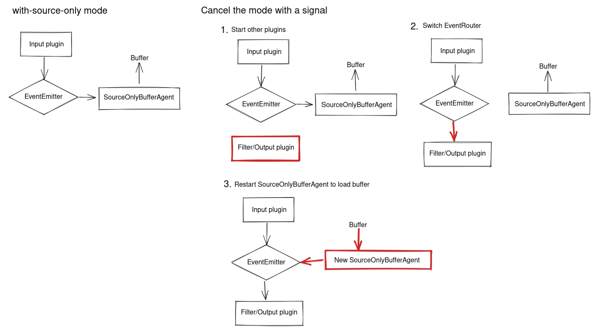

# Source Only Mode

Since v1.18.0, Fluentd can launch with source-only mode.
(Not supported on Windows)

* In this mode, only input plugins run.
* During this mode, the events are stored in a temporary file buffer.
* Sending `SIGWINCH` to the supervisor cancels this mode.
  * Then, all plugins start to run, and the temporary file buffer starts to load.

## How to launch Fluentd with source-only mode

You can launch Fluentd with source-only mode in the following ways.

* [Command Line Option - --with-source-only](command-line-option.md)
* [System Configuration - with_source_only](system-config.md#with_source_only)

## Temporary file buffer

During source-only mode, the ingested events are stored in a temporary file buffer.
After `SIGWINCH` is sent to the supervisor and this mode is canceled, this buffer begins to load.

By default, the file buffer path is as follows.

* `/tmp/fluent/source-only-buffer/{Unique ID for the Fluentd instance}`

You can confirm it in the following log output at startup.

```
[info]: #0 with-source-only: the emitted data will be stored in the buffer files under
/tmp/fluent/source-only-buffer/bbd9006d-bc41-418b-b346-f80888641dda. You can send SIGWINCH to
the supervisor process to cancel with-source-only mode and process data.
```

This file buffer is the buffer of [out_buffer](../output/buffer.md).
It works with the default settings of `out_buffer` except for the following points:

* `path` is automatically determined by default.
* `overflow_action` is `drop_oldest_chunk` by default.

If needed, you can configure some options for the buffer in System Configuration.
Please see the following for details.

* [System Configuration - source_only_buffer section](system-config.md#less-than-source_only_buffer-greater-than-section).

### Recovery

If Fluentd stops with the temporary buffer remained, you need to recover the buffer to launch Fluentd with source-only mode again.

Note that a different path will be used each time unless you configure the temporary buffer path explicitly.
In this case, you can recover the buffer as follows.

1. Configure the remaining buffer path explicitly.
1. Start Fluentd with source-only mode again.
1. Send `SIGWINCH` to the supervisor to load the buffer.

If this recovery is necessary, i.e., Fluentd stops with the temporary buffer remained, the following warning log will be displayed.
You can confirm the path to configure by this log.

```
[warn]: #0 some buffer files remain in /tmp/fluent/source-only-buffer/bbd9006d-bc41-418b-b346-f80888641dda.
Please consider recovering or saving the buffer files in the directory. To recover them, you can set
the buffer path manually to system config and retry, i.e., restart Fluentd with with-source-only mode
and send SIGWINCH again. Config Example:
<system>
  <source_only_buffer>
    path /tmp/fluent/source-only-buffer/bbd9006d-bc41-418b-b346-f80888641dda
  </source_only_buffer>
</system>
```

## Mechanism



If this article is incorrect or outdated, or omits critical information, please [let us know](https://github.com/fluent/fluentd-docs-gitbook/issues?state=open). [Fluentd](http://www.fluentd.org/) is an open-source project under [Cloud Native Computing Foundation \(CNCF\)](https://cncf.io/). All components are available under the Apache 2 License.
