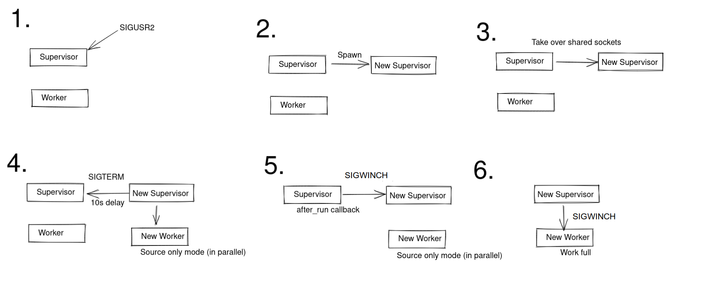

# Zero-downtime restart

This feature supports a complete restart of Fluentd.
This restarts Fluentd so that some input plugins don't have down time.

Supported standard input plugins are as follows.

| supported input plugin | version |
| :---                   | :---    |
| in_udp                 | v1.18.0 |
| in_tcp                 | v1.18.0 |
| in_syslog              | v1.18.0 |

If these input plugins are down, client applications may fail to send data.
You can use this feature to completely restart Fluentd without losing data for these plugins even if that client does not have a resend feature.

## How to use this feature

You can use this feature in the following ways.

* [Signals - SIGUSR2](signals.md#sigusr2)
* [RPC](rpc.md)

## Mechanism of zero-downtime restart

1. Receive `SIGUSR2`.
2. Spawn a new supervisor.
3. Take over shared sockets.
4. Launch new workers, and stop old processes in parallel.
   * Launch new workers with [Source Only Mode](source-only-mode.md).
     * In addition to the source-only mode limitation, Fluentd further limits the starting plugins to only those that support this feature.
     * Data received by the new workers are stored in the temporary buffer of source-only mode.
     * For details on the temporary buffer, see [Source Only Mode - Temporary file buffer](source-only-mode.md#temporary-file-buffer).
   * Send `SIGTERM` to the old supervisor after `10s` delay.
5. The old supervisor stops and sends `SIGWINCH` to the new one.
6. The new workers starts to run fully.
   * The temporary buffer of source-only mode starts to load.

## Plugins: how to support this feature

See [How to Write Input Plugin - zero_downtime_restart_ready?](../plugin-development/api-plugin-input.md#zero_downtime_restart_ready).

If this article is incorrect or outdated, or omits critical information, please [let us know](https://github.com/fluent/fluentd-docs-gitbook/issues?state=open). [Fluentd](http://www.fluentd.org/) is an open-source project under [Cloud Native Computing Foundation \(CNCF\)](https://cncf.io/). All components are available under the Apache 2 License.
