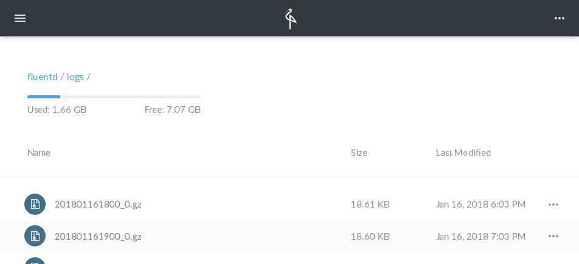

# Send Apache Logs to Minio

This article explains how to use Fluentd to aggregate and transport Apache logs to a [Minio](https://www.minio.io) server.

## Prerequisites

The following software/services are required to be set up correctly:

* [Fluentd](https://www.fluentd.org/)
* [Minio](https://minio.io/download/) (S3 Compatible Storage)
* [Apache](https://httpd.apache.org/) (with the Combined Log Format)

You can install Fluentd via major packaging systems.

* [Installation](../installation/)

### Install plugin

If [`out_s3`](../output/s3.md) (fluent-plugin-s3) is not installed yet, please install it manually.

See [Plugin Management](../installation/post-installation-guide#plugin-management) section how to install fluent-plugin-s3 on your environment.


If you use `fluent-package`, out_s3 (fluent-plugin-s3) is bundled by default.


## Configuration

### Input Settings

In this example, we use the access log file as an input source, so save the following `<source>` settings to `/etc/fluent/fluentd.conf`:

```text
<source>
  @type tail
  format apache2
  path /var/log/apache2/access.log
  pos_file /var/log/fluent/apache.access.log.pos
  tag minio.apache.access
</source>
```


NOTE: If you are using the standalone version of Fluentd, use `/etc/fluent/fluent.conf` instead.


Before proceeding, please confirm that the access log file has proper file permission. If the log file is not readable by the `fluent-package`/`fluentd`, the rest of this article will not work.

### Output Settings

Now let's add settings for storing the incoming data in your Minio server. Since Minio is compatible with Amazon Simple Storage Service \(S3\), we can use the [`out_s3`](../output/s3.md) plugin to connect to the server.

```text
<match minio.apache.**>
  @type s3
  aws_key_id ACCESS_KEY         # The access key for Minio
  aws_sec_key SECRET_KEY        # The secret key for Minio
  s3_bucket BUCKET_NAME         # The bucket to store the log data
  s3_endpoint ENDPOINT          # The endpoint URL (like "http://localhost:9000/")
  s3_region us-east-1           # See the region settings of your Minio server
  path logs/                    # This prefix is added to each file
  time_slice_format %Y%m%d%H%M  # This timestamp is added to each file name

  <buffer time>
    @type file
    path /var/log/fluent/s3
    timekey 60m                 # Flush the accumulated chunks every hour
    timekey_wait 1m             # Wait for 60 seconds before flushing
    timekey_use_utc true        # Use this option if you prefer UTC timestamps
    chunk_limit_size 256m       # The maximum size of each chunk
  </buffer>
</match>
```

After adding the settings to the conf file, please restart the Fluentd daemon.

## Test the Settings

Use `curl` to generate some log data for testing:

```text
$ curl http://localhost/
```

Or you can use the Apache Bench for the bulk request generation:

```text
$ ab -n 100 -c 10 http://localhost/
```

Wait until the data gets flushed from the buffer \(you can adjust the flush interval using the `timekey` and `timekey_wait` options above\). Then you will see the aggregated log data on Minio:



## Learn More

* [Fluentd Architecture](http://www.fluentd.org/architecture)
* [Amazon S3 Output plugin](../output/s3.md)

If this article is incorrect or outdated, or omits critical information, please [let us know](https://github.com/fluent/fluentd-docs-gitbook/issues?state=open). [Fluentd](http://www.fluentd.org/) is an open-source project under [Cloud Native Computing Foundation \(CNCF\)](https://cncf.io/). All components are available under the Apache 2 License.

