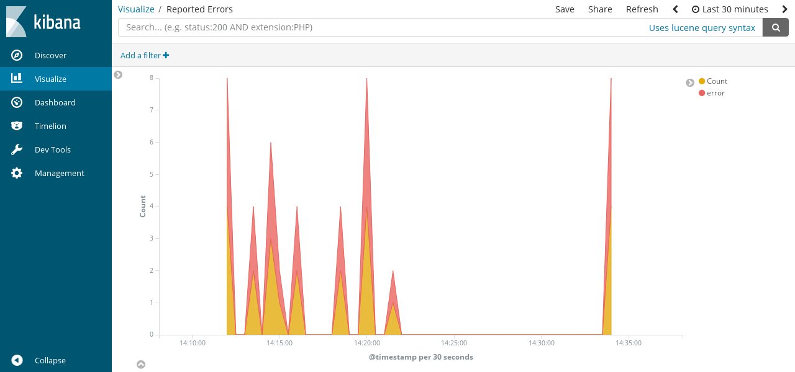
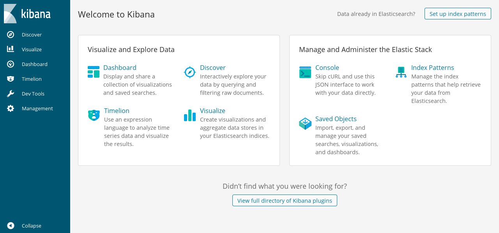
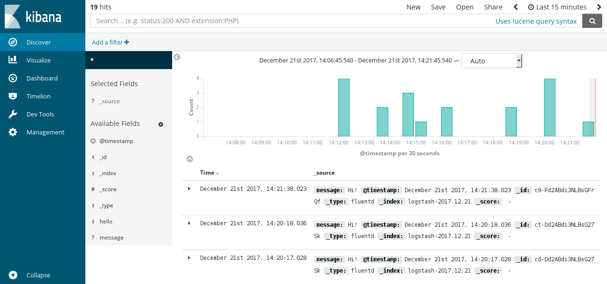

# Free Alternative To Splunk

[Splunk](https://www.splunk.com/) is a great tool for searching logs, but its high cost makes it prohibitive for many teams. In this article, we present a free and open-source alternative to Splunk by combining three open source projects: Elasticsearch, Kibana, and Fluentd.



[Elasticsearch](https://www.elastic.co/products/elasticsearch) is an open-source search engine well-known for its ease of use. [Kibana](https://www.elastic.co/products/kibana) is an open-source Web UI that makes Elasticsearch user friendly for marketers, engineers and data scientists alike.

By combining these three tools \(Fluentd + Elasticsearch + Kibana\) we get a scalable, flexible, easy to use log search engine with a great Web UI that provides an open-source Splunk alternative, all for free.


In this guide, we will go over the installation, setup, and basic use of this combined log search solution. This article was tested on Ubuntu 24.04. **If you're not familiar with Fluentd**, please learn more about Fluentd first.

## Prerequisites

* Java runtime (OpenJDK - JRE 21)
* [Fluentd](https://www.fluentd.org/)
* [Elasticsearch](https://www.elastic.co/elasticsearch)
* [Kibana](https://www.elastic.co/kibana)
* [Fluentd Elasticsearch Plugin](../output/elasticsearch.md)

You can install Fluentd via major packaging systems.

* [Installation](../installation/)

### Java for Elasticsearch

Please confirm that Java version 21 or higher is installed:

```text
$ java --version
openjdk 21.0.5 2024-10-15
OpenJDK Runtime Environment (build 21.0.5+11-Ubuntu-1ubuntu124.04)
OpenJDK 64-Bit Server VM (build 21.0.5+11-Ubuntu-1ubuntu124.04, mixed mode, sharing)
```

### Set Up Elasticsearch

To install Elasticsearch, please download and extract the Elasticsearch package as shown below:

```text
$ curl -O https://artifacts.elastic.co/downloads/elasticsearch/elasticsearch-8.17.1-linux-x86_64.tar.gz
$ tar -xf elasticsearch-8.17.1-linux-x86_64.tar.gz
$ cd elasticsearch-8.17.1
```

Once the installation is complete, start Elasticsearch:

```text
$ ./bin/elasticsearch
```


* You can also install Elasticsearch \(and Kibana\) using RPM/DEB packages. For details, please refer to [the official instructions](https://www.elastic.co/downloads).
* You can create enrollment token for kibana. Use `./bin/elasticsearch-create-enrollment-token -s kibana`.
* You can reset default password for `elastic`, Use `./bin/elasticsearch-reset-password -u elastic`.


### Set Up Kibana

To install Kibana, download it from the official website and extract it. Kibana is an HTML/CSS/JavaScript application \([download](https://www.elastic.co/downloads/kibana)\). Use the binary for 64-bit Linux systems.

```text
$ curl -O https://artifacts.elastic.co/downloads/kibana/kibana-8.17.1-linux-x86_64.tar.gz
$ tar -xf kibana-8.17.1-linux-x86_64.tar.gz
$ cd kibana-8.17.1-linux-x86_64
```

Once the installation is complete, start Kibana i.e. `./bin/kibana`. You can modify its configuration file \(`config/kibana.yml`\).

```text
$ ./bin/kibana
```

Access `http://localhost:5601` in your browser.

## Set Up Fluentd \(`fluent-package`\)

You can install Fluentd via major packaging systems.

* [Installation](../installation/)

Next, we'll install the Elasticsearch plugin for Fluentd: fluent-plugin-elasticsearch. Then, install `fluent-plugin-elasticsearch`.

See [Plugin Management](..//installation/post-installation-guide#plugin-management) section how to install fluent-plugin-elasticsearch on your environment.

We'll configure fluent-package \(Fluentd\) to interface properly with Elasticsearch. Please modify `/etc/fluent/fluentd.conf` as shown below:

```text
# get logs from syslog
<source>
  @type syslog
  port 42185
  tag syslog
</source>

# get logs from fluent-logger, fluent-cat or other fluentd instances
<source>
  @type forward
</source>

<match syslog.**>
  @type elasticsearch
  host localhost
  user elastic
  password (ELASTIC_USER_PASSWORD_HERE)
  logstash_format true
  scheme https
  ssl_verify false
  include_timestamp true
  <buffer>
    flush_interval 10s # for testing
  </buffer>
</match>
```


In this article, it disables verification of TLS explicitly for elasticsearch because of demonstration. Do not disable on production.


`fluent-plugin-elasticsearch` comes with a `logstash_format` option that allows Kibana to search through the stored event logs in Elasticsearch.

Once everything has been set up and configured, start `fluentd`:

```text
$ sudo systemctl start fluentd
```

## Set Up `rsyslogd`

The final step is to forward the logs from your `rsyslogd` to `fluentd`. Please create the file with following line to `/etc/rsyslog.d/90-fluentd.conf`, and restart `rsyslog`. This will forward the local syslogs to Fluentd, and Fluentd in turn will forward the logs to Elasticsearch.

```text
*.* @127.0.0.1:42185
```

Please restart the `rsyslog` service once the modification is complete:

```text
$ sudo systemctl restart rsyslog
```

## Store and Search Event Logs

Once Fluentd receives some event logs from `rsyslog` and has flushed them to Elasticsearch, you can view, search and visualize the log data using Kibana.

For starters, let's access `http://localhost:5601` and click the `Set up index patters` button in the upper-right corner of the screen.



Kibana will start a wizard that guides you through configuring the data sets to visualize. If you want a quick start, use `logstash-*` as the index pattern, and select `@timestamp` as the time-filter field.

After setting up an index pattern, you can view the system logs as they flow in:



For more detail on how to use Kibana, please read the official [manual](https://www.elastic.co/guide/en/kibana/current/index.html).

To manually send logs to Elasticsearch, please use the `logger` command:

```text
$ logger -t test foobar
```

When debugging your `fluentd` configuration, using [`filter_stdout`](../filter/stdout.md) will be useful. All the logs including errors can be found at `/etc/fluent/fluentd.log`.

```text
<filter syslog.**>
  @type stdout
</filter>

<match syslog.**>
  @type elasticsearch
  host localhost
  user elastic
  password (ELASTIC_USER_PASSWORD_HERE)
  logstash_format true
  scheme https
  ssl_verify false
  include_timestamp true
  <buffer>
    flush_interval 10s # for testing
  </buffer>
</match>
```

## Conclusion

This article introduced the combination of Fluentd and Kibana \(with Elasticsearch\) which achieves a free alternative to Splunk: storing and searching machine logs. The examples provided in this article have not been tuned.

If you will be using these components in production, you may want to modify some of the configurations \(e.g. JVM, Elasticsearch, Fluentd buffer, etc.\) according to your needs.

## Learn More

* [Fluentd Architecture](https://www.fluentd.org/architecture)
* [Fluentd Get Started](../quickstart/)
* [Downloading Fluentd](http://www.fluentd.org/download)

If this article is incorrect or outdated, or omits critical information, please [let us know](https://github.com/fluent/fluentd-docs-gitbook/issues?state=open). [Fluentd](http://www.fluentd.org/) is an open-source project under [Cloud Native Computing Foundation \(CNCF\)](https://cncf.io/). All components are available under the Apache 2 License.

