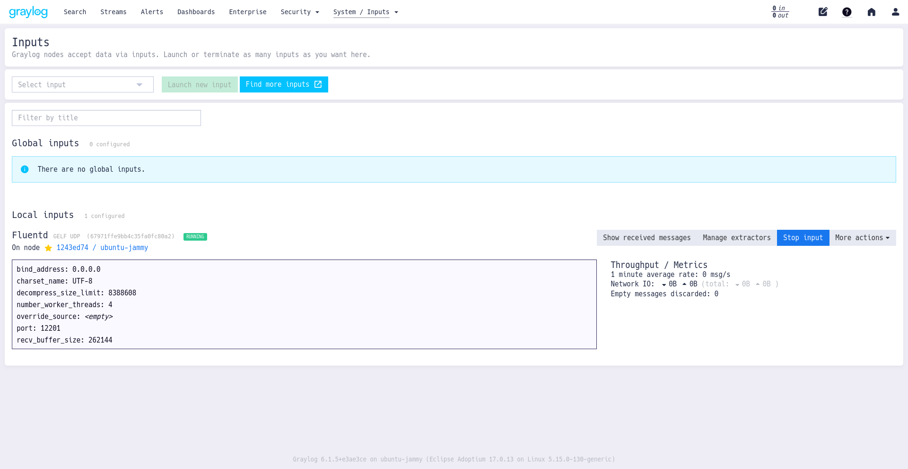
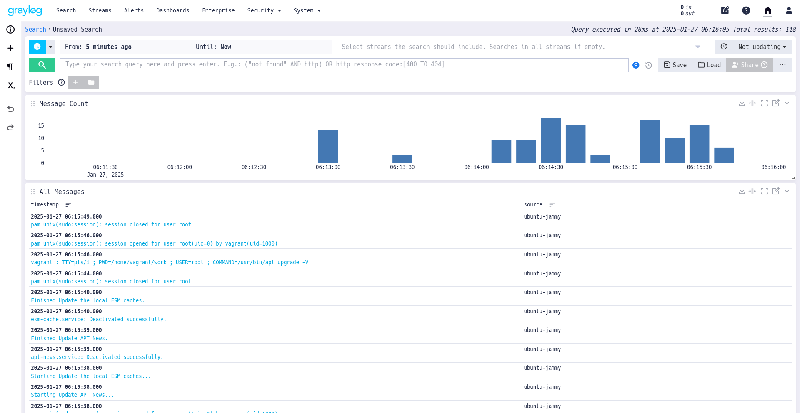

# Send Syslog Data to Graylog

This article explains how to set up Fluentd with [Graylog](https://www.graylog.org). Graylog is a popular log management server powered by Elasticsearch and MongoDB. You can combine Fluentd and Graylog to create a scalable log analytics pipeline.

## Prerequisites

* Basic Understanding of Fluentd
* Linux Server (Ubuntu 24.04 LTS is not supported yet. Use 20.04 or 22.04)
* [Fluentd](https://www.fluentd.org/)
* [MongoDB Community Server](https://www.mongodb.com/try/download/community), Use 7.0.
* [Graylog](https://graylog.org/), Use 6.1.

<!-- Ubuntu 24.04LTS is not officially supported for Graylog2 6.0-->

You can install Fluentd via major packaging systems.

* [Installation](../installation/)

You can install MongoDB via major packaging systems.

* [MongoDB Community Server](https://www.mongodb.com/try/download/community)


Use MongoDB 7.x because Graylog 6.1 does not support MongoDB 8.x.


You can install Graylog Data Node and Server on Ubuntu.

* [Ubuntu Installation](https://go2docs.graylog.org/current/downloading_and_installing_graylog/ubuntu_installation.htm)

### Prepare Graylog for Fluentd

Go to [http://localhost:9000](http://localhost:9000) and log into the web interface.

To log in, use `admin` as the username and `YOUR_PASSWORD` as the password \(the one you have set up for `root_password_sha2`\).

Once logged in, click on `System` in the top nav. Next, click on `Inputs` from the left navigation bar. \(Or, simply go to [http://localhost:9000/system/inputs](http://localhost:9000/system/inputs).

Then, from the dropdown, choose `GELF UDP` and click on `Launch new input`, which should pop up a modal dialogue, Select the `Node` and fill the `Title`. Then, click `Save`.



Now, Graylog is ready to accept messages from Fluentd over UDP. It is time to configure Fluentd.


There might be a case that modal dialogue will not shown when clicking `Launch new input`. Check your browser configuration.


### Fluentd

You can install Fluentd via major packaging systems.

* [Installation](../installation/)

#### Install MongoDB Plugin

If `out_gelf` (fluent-plugin-gelf-hs) is not installed yet, please install it manually.

See [Plugin Management](..//installation/post-installation-guide#plugin-management) section how to install fluent-plugin-gelf-hs on your environment.

Then, configure `/etc/fluent/fluentd.conf` as follows:

```text
<source>
  @type syslog
  tag graylog
</source>

<match graylog.**>
  @type gelf
  host 127.0.0.1
  port 12201
  <buffer>
    flush_interval 5s
  </buffer>
</match>
```

Create `/etc/rsyslog.d/90-fluentd.conf` and add the following line to the file:

```text
*.* @127.0.0.1:5140
```

Finally, restart `rsyslog` and Fluentd with the following commands:

```text
$ sudo systemctl restart rsyslog
$ sudo systemctl restart fluentd
```

## Visualize the Data Stream

When you log back into Graylog, you should be seeing a graph like this \(wait for events to flow in\):



If this article is incorrect or outdated, or omits critical information, please [let us know](https://github.com/fluent/fluentd-docs-gitbook/issues?state=open). [Fluentd](http://www.fluentd.org/) is an open-source project under [Cloud Native Computing Foundation \(CNCF\)](https://cncf.io/). All components are available under the Apache 2 License.

