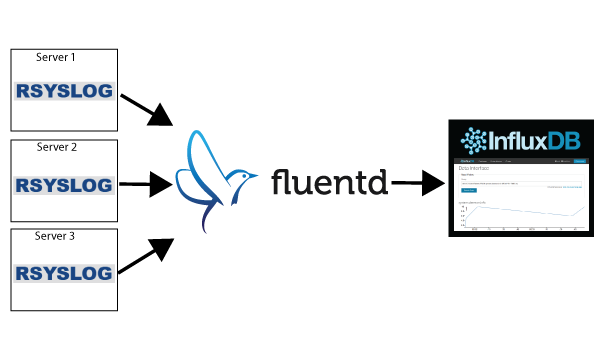
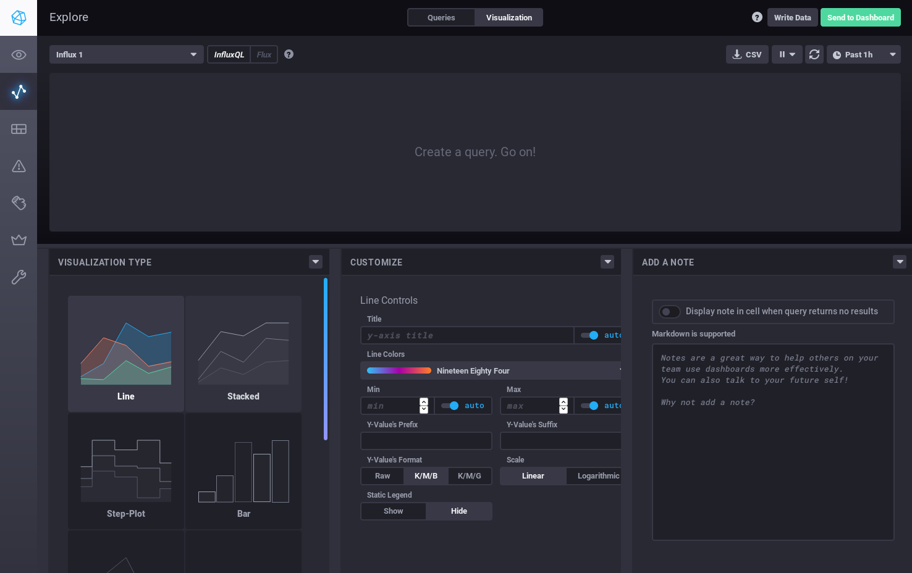
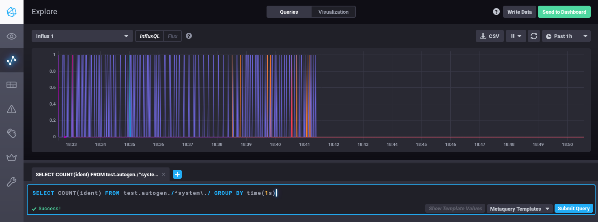
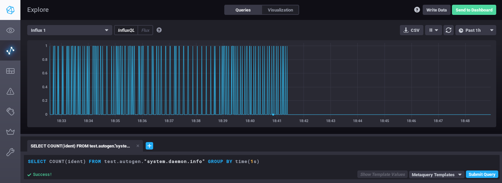

# Send Syslog Data to InfluxDB

This article shows how to collect `syslog` data into [InfluxDB](https://github.com/influxdata/influxdb) using Fluentd.



## Prerequisites

* A basic understanding of [Fluentd](https://www.fluentd.org/)
* A running instance of `rsyslogd`
* [InfluxDB](https://www.influxdata.com/)
* Your InfluxDB access token
* [Chronograf](https://www.influxdata.com/time-series-platform/chronograf/)

You can install Fluentd via major packaging systems.

* [Installation](../installation/)

## Step 1: Install InfluxDB

You can install InfluxDB via major packaging systems.

* [Install InfluxDB OSS v2](https://docs.influxdata.com/influxdb/v2/install/)

Once it is installed, you can run it with:

```text
$ sudo systemctl start influxdb
```

Then, run the initial setup process and create/configure the following:

* Create `influxdb` user
* Create proper operation token
* Set `fluent` organization
* Create `test` bucket
* Crete access API token

See [Set up InfluxDB](https://docs.influxdata.com/influxdb/v2/get-started/setup/).

Then, you can verify that InfluxDB is running:

```text
$ curl --header "Authorization: Token (INFLUXDB_ACCESS_TOKEN_HERE)" "http://localhost:8086/query?q=show+databases"
```

If InfluxDB is running normally, you will see an object that contains the `_monitoring`, `_tasks` and `test` database:

```javascript
{"results":[{"statement_id":0,"series":[{"name":"databases","columns":["name"],"values":[["_monitoring"],["_tasks"],["test"]]}]}]}
```

We are done for now.

## Step 2: Install Fluentd and the InfluxDB plugin

You can install Fluentd via major packaging systems.

* [Installation](../installation/)

Next, install the InfluxDB output plugin:

If [`out_influxdb`](https://github.com/influxdata/influxdb-plugin-fluent) (fluent-plugin-influxdb-v2) is not installed yet, please install it manually.

See [Plugin Management](../installation/post-installation-guide.md#plugin-management) section how to install fluent-plugin-influxdb-v2 on your environment.


Do not install fluent-plugin-influxdb, it does not support for InfluxDB v2.


Finally, configure `/etc/fluent/fluentd.conf` as follows:

```text
<source>
  @type syslog
  port 42185
  tag system
</source>

<match system.*.*>
  @type influxdb
  url http://localhost:8086
  org fluent
  bucket test
  token "ACCESS_TOKEN_HERE"
  use_ssl false
  <buffer>
    flush_interval 10s # for testing
  <buffer>
</match>
```

Restart `fluentd` with `sudo systemctl restart fluentd`.

## Step 3: Configure `rsyslogd`

If remote `rsyslogd` instances are already collecting data into the aggregator `rsyslogd`, the settings for `rsyslog` should remain unchanged. However, if this is a brand new setup, create `/etc/rsyslogd.d/90-fluentd.conf` and append the following line:

```text
*.* @localhost:42185
```

You should replace `localhost` with the IP address of your aggregator server. Also, there is nothing special about port `42185` \(do make sure this port is open though\).

Now, restart `rsyslogd`:

```text
$ sudo systemctl restart rsyslog
```

## Step 4: Confirm Data Flow

Your `syslog` data should be flowing into InfluxDB every 10 seconds \(this is configured by `flush_interval`\).

For visualizing incoming data, you can use the InfluxDB UI by default and as an option, you can use `Chronograf` with InfluxDB v2.

You can install Chronograf via major packaging systems.

* [Install Chronograf](https://docs.influxdata.com/chronograf/v1/introduction/installation/)


Setup Chronograf "InfluxDB v2 Auth" to connect with InfluxDB v2. See [Use Chronograf with InfluxDB OSS](https://docs.influxdata.com/influxdb/v2/tools/chronograf/).


Then, go to http://localhost:8888 and clicking on `Explore` brings up the query interface that **lets you write SQL queries against your log data**.

And then click `Visualization` and select the line chart:



Now, switch to `Queries` to count the number of lines of `syslog` messages per facility/priority:

```sql
SELECT COUNT(ident) FROM test.autogen./^system\./ GROUP BY time(1s)
```

Click on **Submit Query** to get a graph like this:



Here is another screenshot for the `system.daemon.info` series:



If this article is incorrect or outdated, or omits critical information, please [let us know](https://github.com/fluent/fluentd-docs-gitbook/issues?state=open). [Fluentd](http://www.fluentd.org/) is an open-source project under [Cloud Native Computing Foundation \(CNCF\)](https://cncf.io/). All components are available under the Apache 2 License.

