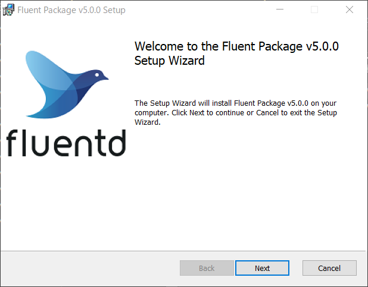

# Install `fluent-package` by .msi Installer \(Windows\)

The recommended way to install Fluentd on Windows is to use MSI installers of `fluent-package`.

## What is `fluent-package`?

`fluent-package` is a packaged distribution of Fluentd which is formerly known as `td-agent`.

* Includes Ruby and other library dependencies \(since most Windows machines don't have them installed\).
* Includes a set of commonly-used 3rd-party plugins such as `in_windows_eventlog2`.

You can also see [fluent-package-v5-vs-td-agent](../quickstart/fluent-package-v5-vs-td-agent.md) for the comparison and supported OS.

## How to install `fluent-package`


NOTE:

* About deprecated [Treasure Agent (td-agent) v4 (EOL)](https://www.fluentd.org/blog/schedule-for-td-agent-4-eol), see [Install by .msi Installer v4 (Windows)](install-by-msi-td-agent-v4.md).
* About deprecated [Treasure Agent (td-agent) 3 will not be maintained anymore](https://www.fluentd.org/blog/schedule-for-td-agent-3-eol), see [Install by msi Package  v3](install-by-msi-td-agent-v3.md).
* Do not directly upgrade from v3 to v5. Such a workflow is not supported. It causes a trouble. Upgrade in stages. (v3 to v4, then v4 to v5)


### Step 1: Install `fluent-package`

Download the latest MSI installer from [the download page](https://td-agent-package-browser.herokuapp.com/5/windows). Run the installer and follow the wizard.
If you want to use Long Term Support version, use [LTS](https://td-agent-package-browser.herokuapp.com/lts/5/windows).



### Step 2: Set up `fluentd.conf`

Open `C:/opt/fluent/etc/fluent/fluentd.conf` with a text editor. Replace the configuration with the following content:

```text
<source>
  @type windows_eventlog2
  @id windows_eventlog2
  channels application
  read_existing_events false
  tag winevt.raw
  rate_limit 200
  <storage>
    @type local
    persistent true
    path C:\opt\fluent\winlog.json
  </storage>
</source>

<match winevt.raw>
  @type stdout
</match>
```

### Step 3: Launch Fluent Package Command Prompt with Administrator privilege

Open Windows Start menu, and search `Fluent Package Command Prompt`. In most environments, the program will be found right under the "Recently Added" section or "Best match" section.


`Fluent Package Command Prompt` is basically `cmd.exe`, with a few PATH tweaks for Fluentd programs. Use this program whenever you need to interact with Fluentd.

### Step 4: Run `fluentd`

Type the following command into `Fluent Package Command Prompt` with Administrator privilege:

```text
C:\opt\fluent> fluentd
```

Now `fluentd` starts listening to Windows Eventlog, and will print records to stdout as they occur.


### Step 5: Run `fluentd` as Windows service

Fluentd is registered as a Windows service permanently by the msi installer.
Since version 5.0.0, the service does not automatically start after installed. You must manually start it.

Choose one of your preferred way:

* Using GUI
* Using `net.ext`
* Using Powershell Cmdlet

#### Using GUI

Please guide yourself to `Control Panel -> System and Security -> Administrative Tools -> Services`, and you'll see `Fluentd Windows Service` is listed.

Please double click `Fluentd Window Service`, and click `Start` button. Then the process will be executed as Windows Service.

#### Using `net.exe`

```text
> net start fluentdwinsvc
The Fluentd Windows Service service is starting..
The Fluentd Windows Service service was started successfully.
```

#### Using Powershell Cmdlet

```text
PS> Start-Service fluentdwinsvc
```

Note that using `fluentdwinsvc` is needed to start Fluentd service from the command-line. `fluentdwinsvc` is the service name and it should be passed to `net.exe` or `Start-Service` Cmdlet.

The log file will be located at `C:/opt/fluent/fluentd.log` as we specified in Step 3.

### Step 6: Install Plugins

Open `Fluent Package Command Prompt` and use `fluent-gem` command:

```text
C:\opt\fluent> fluent-gem install fluent-plugin-xyz --version=1.2.3
```

## Next Steps

You are now ready to collect real logs with Fluentd. Refer to the following tutorials on how to collect data from various sources:

* Basic Configuration
  * [Config File](../configuration/config-file.md)
* Application Logs
  * [Ruby](../language-bindings/ruby.md)
  * [Java](../language-bindings/java.md)
  * [Python](../language-bindings/python.md)
  * [PHP](../language-bindings/php.md)
  * [Perl](../language-bindings/perl.md)
  * [Node.js](../language-bindings/nodejs.md)
  * [Scala](../language-bindings/scala.md)
* Examples
  * [Store Apache Log into Amazon S3](../how-to-guides/apache-to-s3.md)
  * [Store Apache Log into MongoDB](../how-to-guides/apache-to-mongodb.md)
  * [Data Collection into HDFS](../how-to-guides/http-to-hdfs.md)

If this article is incorrect or outdated, or omits critical information, please [let us know](https://github.com/fluent/fluentd-docs-gitbook/issues?state=open). [Fluentd](http://www.fluentd.org/) is an open-source project under [Cloud Native Computing Foundation \(CNCF\)](https://cncf.io/). All components are available under the Apache 2 License.
