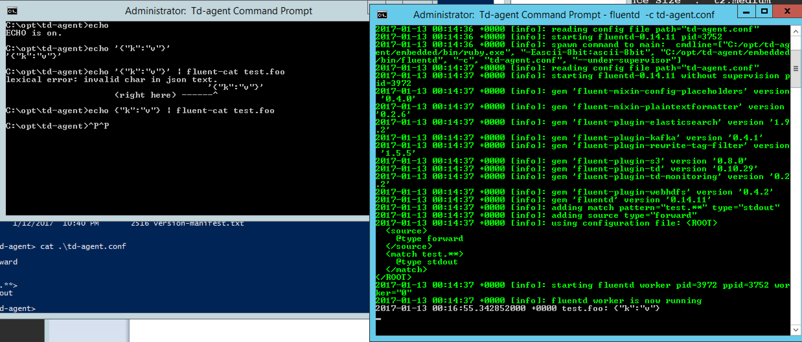

# Install by .msi Installer v3 \(Windows\)

The recommended way to install Fluentd on Windows is to use MSI installers of `td-agent`.

## What is `td-agent`?

`td-agent` is a packaged distribution of Fluentd.

* Includes Ruby and other library dependencies \(since most Windows machines don't have them installed\).
* Includes a set of commonly-used 3rd-party plugins such as `out_es`.
* Originally developed by [Treasure Data, Inc](http://www.treasuredata.com/) \(hence the name\).

Currently two versions of `td-agent` are available.

* `td-agent` v4 packages Fluentd 1.11.x \(or later\). This version is recommended.
* `td-agent` v3 packages Fluentd 1.10.x \(or below\).

## `td-agent` v3


This article contains deprecated td-agent (EOL) information: SHOULD NOT use td-agent anymore.

* As [Treasure Agent (td-agent) 3 will not be maintained anymore](https://www.fluentd.org/blog/schedule-for-td-agent-3-eol), recommend to [Upgrade td-agent from v3 to v4](https://www.fluentd.org/blog/upgrade-td-agent-v3-to-v4).
* Do not directly upgrade from v3 to fluent-package v5. Such a workflow is not supported. It causes a trouble. Upgrade in stages. (v3 to v4, then v4 to v5)
* Package archive was migrated from [packages.treasuredata.com](https://packages.treasuredata.com) to [fluentd.cdn.cncf.io](https://fluentd.cdn.cncf.io/index.html).


### Step 1: Install `td-agent`

Please download and install the `.msi` file from here:

* [Download](https://td-agent-package-browser.herokuapp.com/3/windows)

### Step 2: Run `td-agent` from Command Prompt

First, please prepare your config file located at `C:/opt/td-agent/etc/td-agent/td-agent.conf`. The config below is the simplest example to output any incoming records to `td-agent`'s log file:

```text
<source>
  @type forward
</source>
<match test.**>
  @type stdout
</match>
```

After you have installed the .msi package, you will see the program called `Td-agent Command Prompt` installed. Please double click this icon in the Windows menu \(below is how it looks like on Windows Server 2012\).


In the prompt, please execute the command below to launch `td-agent` process:

```text
> fluentd -c etc\td-agent\td-agent.conf
```

Then, please launch another `Td-agent Command Prompt` and type the command below to send a record to `td-agent` process:

```text
> echo {"message":"hello"} | fluent-cat test.event
```

It's working properly if td-agent process outputs:

```text
test.event: {"k", "v"}
```



### Step 3: Register `td-agent` to Windows Service

Next, register `td-agent` as a Windows Service to permanently run as a server process. Open `Td-agent Command Prompt` with administrative privileges, and type these commands:

```text
> fluentd --reg-winsvc i
> fluentd --reg-winsvc-fluentdopt '-c C:/opt/td-agent/etc/td-agent/td-agent.conf -o C:/opt/td-agent/td-agent.log'
```

**NOTE**: Making `td-agent` service start automatically requires additional command-line parameters:

```text
> fluentd --reg-winsvc i --reg-winsvc-auto-start --reg-winsvc-delay-start
> fluentd --reg-winsvc-fluentdopt '-c C:/opt/td-agent/etc/td-agent/td-agent.conf -o C:/opt/td-agent/td-agent.log'
```

### Step 4: Run `td-agent` as a Windows Service

#### Using GUI

Go to `Control Panel > System and Security > Administrative Tools > Services`, and you should see `Fluentd Windows Service` listed there.

Double click on `Fluentd Window Service` and click `Start` to execute it as a Windows Service.

#### Using `net.exe`

```text
> net start fluentdwinsvc
The Fluentd Windows Service service is starting..
The Fluentd Windows Service service was started successfully.
```

#### Using Powershell Cmdlet

```text
PS> Start-Service fluentdwinsvc
```

Note that `fluentdwinsvc` is the Fluentd service name and it should be passed to `net.exe` or `Start-Service` Cmdlet to start.

The log file will be located at `C:/opt/td-agent/td-agent.log` as specified in Step 3 earlier.

### Step 4: Install Plugins

Open `Td-agent Command Prompt` and use `fluent-gem` command:

```text
> fluent-gem install fluent-plugin-xyz --version=1.2.3
```

## Tips

### Manage privileges in td-agent 3.8.1 or later/td-agent 4.1.0 or later

You need admin privilege to execute `td-agent-gem` command. For upgrade users since 3.8.0 or earlier/td-agent 4.0.1 or earlier, explicitly remove privileges for `NT AUTHORITY\Authenticated Users` from `c:\opt\td-agent`.

This change is for fixing [CVE-2020-28169](https://cve.mitre.org/cgi-bin/cvename.cgi?name=CVE-2020-28169).

### Uninstall td-agent v3 being registered to Windows Service

When you uninstall td-agent v3, you should take care to see if it is registered to Windows Service, since td-agent v3 doesn't automatically unregister itself.
If it is registered, you must unregister it manually before uninstalling it.

**NOTE**: If you uninstall td-agent v3 without unregistering it, the service remains after uninstalling and causes the v4 installation to fail.
You need to reinstall td-agent v3 and unregister the service with the following steps.

You can check if it is registered with the following Powershell command:

```text
PS> Get-Service fluentdwinsvc
```

You can unregister td-agent v3 with the following steps:

* Stop the service with the following Powershell command:

```text
PS> Stop-Service fluentdwinsvc
```

* Open `Td-agent Command Prompt` with administrative privileges and type the following command:

```text
> fluentd --reg-winsvc u
```

## Next Steps

You are now ready to collect real logs with Fluentd. Refer to the following tutorials on how to collect data from various sources:

* Basic Configuration
  * [Config File](../configuration/config-file.md)
* Application Logs
  * [Ruby](../language-bindings/ruby.md)
  * [Java](../language-bindings/java.md)
  * [Python](../language-bindings/python.md)
  * [PHP](../language-bindings/php.md)
  * [Perl](../language-bindings/perl.md)
  * [Node.js](../language-bindings/nodejs.md)
  * [Scala](../language-bindings/scala.md)
* Examples
  * [Store Apache Log into Amazon S3](../how-to-guides/apache-to-s3.md)
  * [Store Apache Log into MongoDB](../how-to-guides/apache-to-mongodb.md)
  * [Data Collection into HDFS](../how-to-guides/http-to-hdfs.md)

For further steps, follow these:

* [ChangeLog of td-agent](https://docs.treasuredata.com/display/public/PD/The+td-agent+Change+Log)
* [Chef Cookbook](https://github.com/treasure-data/chef-td-agent/)

If this article is incorrect or outdated, or omits critical information, please [let us know](https://github.com/fluent/fluentd-docs-gitbook/issues?state=open). [Fluentd](http://www.fluentd.org/) is an open-source project under [Cloud Native Computing Foundation \(CNCF\)](https://cncf.io/). All components are available under the Apache 2 License.

