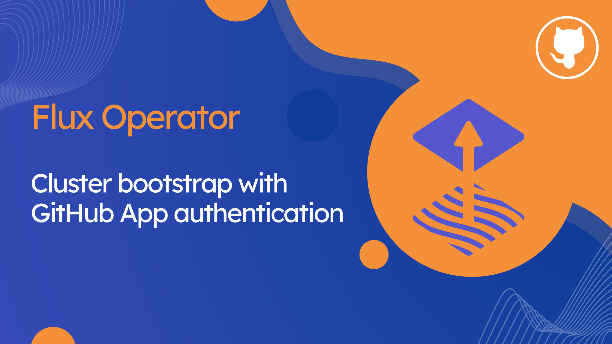

In this blog post, we will showcase how [Flux Operator](https://github.com/controlplaneio-fluxcd/flux-operator)
can be used to bootstrap Kubernetes clusters using the GitHub App authentication method
introduced in [Flux 2.5.0](https://fluxcd.io/blog/2025/02/flux-v2.5.0/).

Prior to Flux 2.5.0, the GitHub repository authentication methods were based on using a
secret that is tied to a GitHub user, be it a personal access token (PAT) or an SSH deploy key.
When the user leaves the organization, the GitHub deploy keys are revoked
resulting in Flux losing access to all repositories. To restore access, the cluster
administrators have to generate new GitHub deploy keys tied to a different user
and rotate the secret in all clusters.

To avoid this situation, the recommendation was for organizations to create a dedicated
GitHub user for Flux, but this is also not ideal since an extra user affects billing.
The login credentials and MFA code have to be stored in an external secret management system
like 1Password, increasing the complexity of the cluster bootstrap process.

Starting with Flux 2.5.0, the GitHub App authentication method allows organizations to create a GitHub App
with access to the repositories from where Flux syncs the desired state of Kubernetes clusters.
Instead of using the credentials of a GitHub user, Flux running on the clusters will use the GitHub App
private key to authenticate with the GitHub API, acquiring a short-lived access token to perform
Git operations.

## Flux Operator

The [Flux Operator](https://github.com/controlplaneio-fluxcd/flux-operator) offers an alternative
to the Flux CLI bootstrap procedure. It removes the operational burden of managing Flux across fleets
of clusters by fully automating the installation, configuration, and upgrade of the Flux controllers
based on a declarative API called `FluxInstance`.

The [FluxInstance](https://fluxcd.control-plane.io/operator/fluxinstance/) custom resource defines
the desired state of the Flux components and allows the configuration of the
[cluster state syncing](https://fluxcd.control-plane.io/operator/flux-sync/)
from Git repositories, OCI artifacts and S3-compatible storage.

When using a GitHub repository as the source of truth, the Flux instance can be configured
to use the GitHub App authentication method by referencing a Kubernetes secret that contains
the app ID, the installation ID and the private key of the GitHub App.

What follows is a step-by-step guide on how to install the Flux Operator and bootstrap
a cluster using the GitHub App authentication.

### Bootstrap using Flux Operator and Helm

First, install the Flux Operator using the Helm chart:

```shell
helm install flux-operator oci://ghcr.io/controlplaneio-fluxcd/charts/flux-operator \
  --namespace flux-system \
  --create-namespace
```

Next, create a GitHub App secret using the `flux` CLI (see docs on how to create a GitHub App
[here](#github-app-docs)):

```shell
flux create secret githubapp flux-system \
  --app-id=1 \
  --app-installation-id=2 \
  --app-private-key=./path/to/private-key-file.pem
```

Finally, bootstrap the cluster by creating a `FluxInstance` custom resource in the `flux-system` namespace:

```yaml
apiVersion: fluxcd.controlplane.io/v1
kind: FluxInstance
metadata:
  name: flux
  namespace: flux-system
spec:
  distribution:
    version: "2.x"
    registry: "ghcr.io/fluxcd"
  components:
    - source-controller
    - kustomize-controller
    - helm-controller
    - notification-controller
    - image-reflector-controller
    - image-automation-controller
  cluster:
    type: kubernetes
    multitenant: false
    networkPolicy: true
    domain: "cluster.local"
  sync:
    kind: GitRepository
    provider: github
    url: "https://github.com/my-org/my-fleet.git"
    ref: "refs/heads/main"
    path: "clusters/my-cluster"
    pullSecret: "flux-system"
```

When the `FluxInstance` is applied on the cluster, the operator will automatically deploy the Flux controllers
and configure them to sync the cluster state from the specified repository using GitHub App authentication.
Similarly to the Flux CLI bootstrap, the operator generates a Flux `GitRepository` and `Kustomization` named
`flux-system` that points to the `clusters/my-cluster` path inside the Git repository.

The Flux instance can be customized in various ways including multi-tenancy lockdown,
sharding, horizontal and vertical scaling, persistent storage, and fine-tuning
the Flux controllers with Kustomize patches.
For more information on the available options, please refer
to the [Flux Operator documentation](https://fluxcd.control-plane.io/operator/flux-config/).

### Bootstrap using Flux Operator and Terraform

Alternatively, you can use Terraform or OpenTofu to install the Flux Operator and
the `FluxInstance`. A Terraform example is available in the
[Flux Operator repository](https://github.com/controlplaneio-fluxcd/flux-operator/blob/main/config/terraform/README.md).

The command for applying this Terraform example with a GitHub App would be the following:

```shell
export GITHUB_APP_PEM=`cat path/to/app.private-key.pem`

terraform apply \
  -var flux_version="2.x" \
  -var flux_registry="ghcr.io/fluxcd" \
  -var github_app_id="1" \
  -var github_app_installation_id="2" \
  -var github_app_pem="$GITHUB_APP_PEM" \
  -var git_url="https://github.com/my-org/my-fleet.git" \
  -var git_ref="refs/heads/main" \
  -var git_path="clusters/production"
```

### GitHub App Docs

* [Registering a GitHub App](https://docs.github.com/en/apps/creating-github-apps/registering-a-github-app/registering-a-github-app)
* [Managing private keys for GitHub Apps](https://docs.github.com/en/apps/creating-github-apps/authenticating-with-a-github-app/managing-private-keys-for-github-apps)
* [Installing your GitHub App](https://docs.github.com/en/apps/using-github-apps/installing-your-own-github-app)

After installing your GitHub App in your organization you can find the *installation ID* like this:

1. Go to the Organization settings
2. Click on 'GitHub Apps' under 'Third-party Access'
3. If there are multiple GitHub apps, choose your App and click on 'Configure'
4. Once your GitHub App is selected check the URL for obtaining 'GitHub App Installation ID'

The URL looks like this:

```
https://github.com/organizations/<Organization-name>/settings/installations/<ID>
```

## Conclusion

Using the GitHub App authentication method with Flux Operator offers a more secure
way of bootstrapping Flux on Kubernetes clusters, as it eliminates the need for managing
GitHub user credentials and deploy keys. This approach ensures that Flux can
continue to operate seamlessly even when users leave the organization or change their access
permissions.

Migrating clusters that have been bootstrapped with the Flux CLI to the Flux Operator
is a straightforward process. For more information on how to do this, please refer to the
[Flux Operator bootstrap migration guide](https://fluxcd.control-plane.io/operator/flux-bootstrap-migration/).
