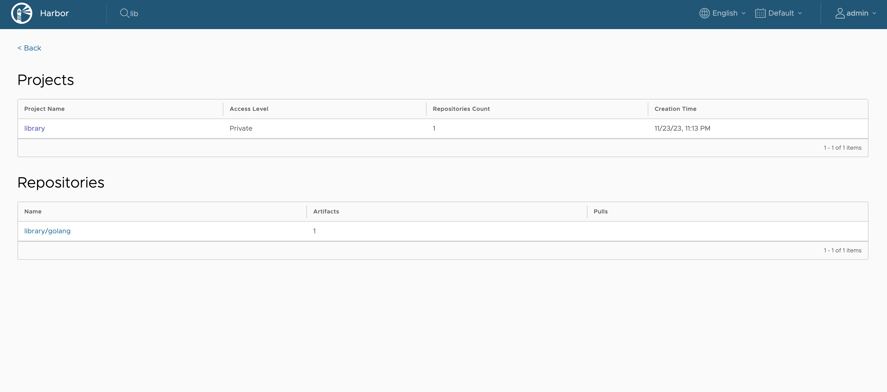
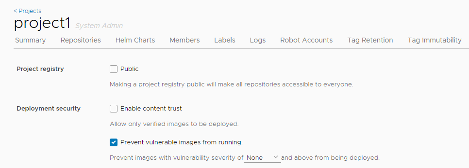
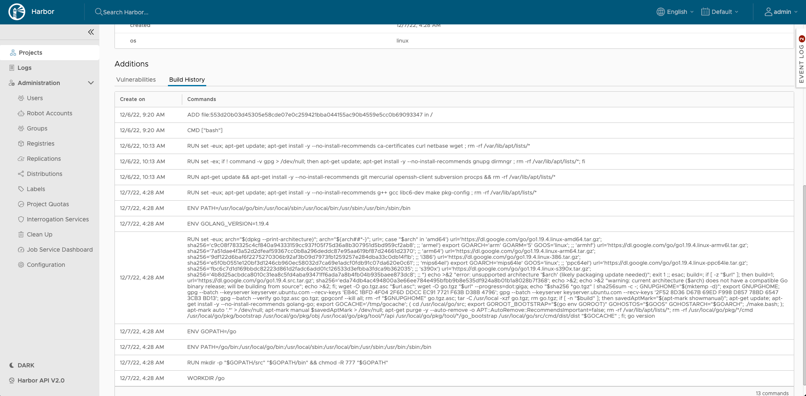

After the initial creation of a project, you can configure or reconfigure its properties in the **Configuration** tab for that project.

1. Log in to the Harbor interface with an account that has at least project administrator privileges.
1. Go to **Projects** and select a project.
1. Select the **Configuration** tab.
1. To make all repositories under the project accessible to everyone, select the `Public` checkbox, or deselect this checkbox to make the project private.
1. To prevent un-signed images under the project from being pulled, select the `Prevent vulnerable images from running` checkbox.

## Searching projects and repositories

Enter a keyword in the search field at the top to list all matching projects and repositories. The search result includes both public and private repositories you have access to.  

## Configure Vulnerability Settings in Projects

You can configure projects so that images with vulnerabilities cannot be run, and to automatically scan images as soon as they are pushed into the project.

1. Log in to the Harbor interface with an account that has at least project administrator privileges.
1. Go to **Projects** and select a project.
1. Select the **Configuration** tab.
1. To prevent vulnerable images under the project from being pulled, select the **Prevent vulnerable images from running** checkbox.

   

1. Select the severity level of vulnerabilities to prevent images from running.

   

   Images cannot be pulled if their level is equal to or higher than the selected level of severity. Harbor does not prevent images with a vulnerability severity of `negligible` from running.
1. To activate an immediate vulnerability scan on new images that are pushed to the project, select the **Automatically scan images on push** check box.

   

Harbor also supports additional deployment security options, allowing you to [implement content trust](../../working-with-projects/project-configuration/implementing-content-trust/) on your Harbor instance.

## Build history

Build history makes it easy to see the contents of a container image, find the code which builds an image, or locate the image for a source repository.

In Harbor portal, enter your project, select the repository, click on the link of artifact you'd like to see its build history, the detail page will be opened. Then switch to `Build History` tab, you can see the build history information.

